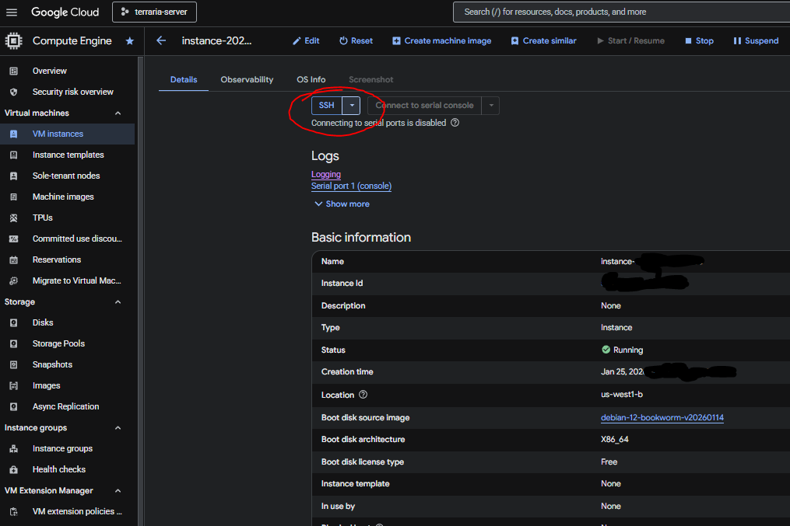

# Hosting a Terraria Server on the Cloud

## Initial Setup

* Follow steps in working_log.md to set up GCP project
* SSH into Compute Engine instance
* Fork this Github repo and modify the repo path in `initial_installation.sh`
* Modify `game_logic/serverconfig.txt` with the world setting you want. You'll only ever get 1 chance to do this.
* Run `initial_installation.sh` to setup foundational dependencies. You should just copy and paste this into the terminal on the cloud machine (one-time setup)
* Now you can get the terraria server running, `bash flash_server.sh`

Hosting 3-5 people cost me about $0.78 per day in January 2026.

## Workflows

### Interacting with the server for administration

Everything is through the command line. You can SSH onto the GCP instance through the UI or by setting up SSH keys. UI is easiest for beginners.



If you are doing any customization, you likely want a working copy of the code in an editor, and the ability to push your changes to GitHub. Any changes you make can be pulled onto the server.

### Restarting the server

* Use `scripts/server_admin.sh` to issue a save and exit, or attach to the `screen` session and do it manually
* Optionally, apply any server version updates, etc
* When ready, just run `bash scripts/run_server.sh` to get the server back online 

### Server updates

* Set new version in `scripts/shared_variables.sh`
* Follow logic in `scripts/update_server_version.sh` and restart server. Always gracefully exit the server first.

### Accessing World files

These live in the location specified in the `scripts/shared_variables.sh` file:

```
WORLD_SAVES_PATH=${WORKSPACE_ROOT}/worlds
WORLD_FILE_PATH=${WORLD_SAVES_PATH}/main_world_file.wld
```

By default, these are auto-created using the parameters in `game_logic/serverconfig.txt`.

### Misc

* Issue game admin commands, like saving the world or sending a global message, in `scripts/server_admin.sh`
* Use `bash scripts/sync_cronjobs.sh` to start background jobs on new server, like sending regular global messages or server backups
* `scripts/ping_discord.sh` provides custom Discord server alerts if the `.env` file contains a valid Discord webhook url

## Known pain points

* No mod support
* No automatic server version updates. New Terraria releases require a server restart.

## Sources

* https://terraria.fandom.com/wiki/Server
* https://docs.google.com/document/d/1KZofwemfcQQCOVlWw4VxOn8MArTOauFWC5EVQvsF_Aw/edit?tab=t.0
* https://terraria.fandom.com/wiki/Guide:Setting_up_a_Terraria_server
* https://terraria.wiki.gg/wiki/Server#Server_files
* https://terraria.wiki.gg/wiki/Server#List_of_console_commands
* https://terraria.wiki.gg/wiki/Server#Command-line_parameters
* https://terraria.fandom.com/wiki/Server#Downloads
