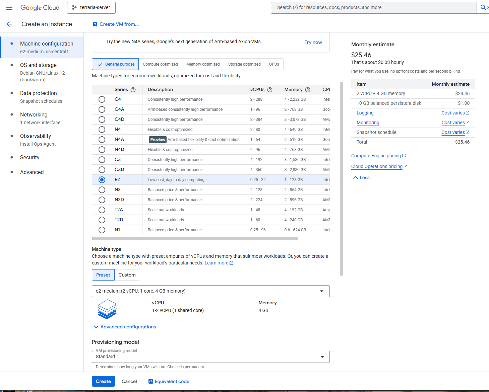
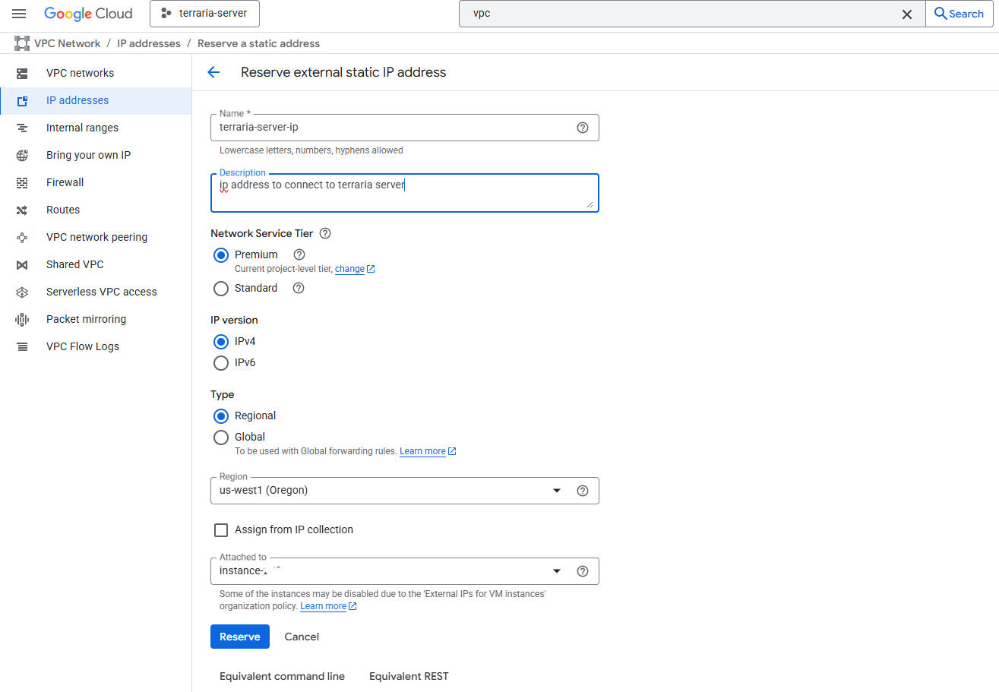
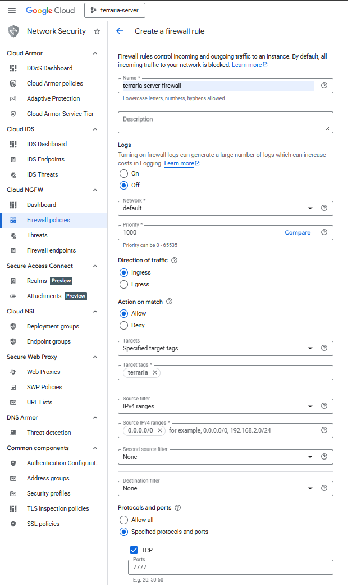

# Working log

## 1/26/2026

Less time to work today. I solved an important bug! The server would not autocreate in headless mode yesterday. I tried everything. It turns out that autocreate requires an absolute world path to function! I got it to autocreate a server with a config like so:

```
world=/home/mike_a_lawrence95/terraria/terraria-server/worlds/the_lands_of_far.wld
autocreate=3
worldname=The Lands of Far
difficulty=2

maxplayers=5
port=7777
password=openup
motd=Embrace the dirt hole
```

then, 

```
./TerrariaServer.bin.x86_64 -config serverconfig.txt
```

This seems to do the trick. Now I need to find a way to verify the world persists, dont crash under load of a few players, etc

I want to definitely address world rollbacks. I think I can copy a backup to `/home/mike_a_lawrence95/terraria/terraria-server/worlds/main_world_file.wld` if truly necessary. This file is also backed up by Terraria itself. See,

```
$ ls -a worlds/

.  ..  main_world_file.wld  main_world_file.wld.bak  main_world_file.wld.bak2
```

## 1/25/2026

New Terraria version coming in 2 days. Will likely come with a new server version to install. This means any progress on setting up a server needs to be reusable.


### Requirements

* Basic flow: create GCP compute engine instance, make SSH flow to it
* Create scripts for the following tasks (may be one or many):
  * Fetch terraria server binary (Something like "https://terraria.org/api/download/pc-dedicated-server/terraria-server-1449.zip")
  * Fetch server configuration from github
  * Startup server in persistent background process (should last beyond SSH session)
    * Save files should be on persistent disk!
    * [Optional] Backup server save files somewhere
  * [Optional] Graceful exit script. Trigger save and then tear down server

### Testing:

* Make clean install on fresh compute engine instance
* Join from Terraria character on steam
* Check world difficulty, password on entrace, etc
* Inspect files on disk. Is config and checkpoint there?
* Turn off instance and back on, restart server. Is the world state correct?

### Execution

For GCP setup, mostly following this [guide](https://docs.google.com/document/d/1KZofwemfcQQCOVlWw4VxOn8MArTOauFWC5EVQvsF_Aw/edit?tab=t.0)

* Made Google Cloud project here to host the VM: https://console.cloud.google.com/welcome?project=terraria-server-485500
  * Set up billing
  * Set billing alert for this project. If costs approach $30 per month, email me
  * "Enable" Compute Engine API from its product page
  * Create new Compute Engine instance. E2-medium in a data center near my friends and I (US West).
    * Added "terraria" network tag on the compute instance
  * Created static external IP address to make connecting consistent for users
  * Added firewall rule (not firewall policy) where i allow all traffic on port 7777 for the "terraria" network tag
  






* Begin test server set up (can click into SSH in browser from Cloud console)
* open github repo to public at https://github.com/Mlawrence95/terraria-server.git
* Created `initial_installation.sh` to pull in github files
* Created `scripts/install_terraria_server_binary.sh` for loading and formatting server binaries
* Created `scripts/shared_variables.sh` to keep constants in sync across files
* Created `scripts/run_server.sh` to start the server up.
